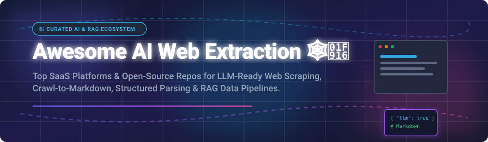

  

# 🕸️🤖 Awesome AI Web Extraction

  
  
  
  
  

> **Curated List of SaaS Products & Open-Source GitHub Projects**  
> *Focused on LLM-Ready Web Scraping, Crawl-to-Markdown, Structured Extraction, Document Parsing & RAG Data Pipelines.*

---

## 💡 Overview & SEO Keywords

Welcome to the definitive directory for **AI-powered Web Extraction**, **LLM Web Scraping**, and **RAG Data Ingestion**. Whether you are building autonomous AI agents, enterprise RAG (Retrieval-Augmented Generation) applications, or structured Web-to-JSON pipelines, this list tracks the top commercial SaaS solutions and self-hostable open-source frameworks.

Key capabilities tracked in this ecosystem:
- 📄 **Crawl-to-Markdown**: Converting complex dynamic HTML to clean Markdown optimized for LLM context windows.
- 🧱 **Structured Extraction**: Extracting strictly typed JSON output using schemas (Zod, Pydantic, Instructor).
- 🔓 **Anti-Bot & Headless Rendering**: Handling Cloudflare, CAPTCHAs, Playwright, and Puppeteer rendering seamlessly.
- 📑 **Document Parsing**: Extracting tables, layouts, and OCR text from mixed PDF/HTML web documents.

---

## 📊 Market Overview & Industry Dynamics

> [!NOTE]  
> **Market Size & Structure**: The global web scraping and AI web data extraction market is estimated at **$3.2B - $4.5B** in 2026, growing at >28% CAGR driven by Generative AI training needs and enterprise RAG pipelines.  
> **Market Fragmentation**: The sector is **moderately fragmented**. High-volume proxy and browser infrastructure is led by established giants (Zyte, Apify, Diffbot), while developer-first AI Markdown crawlers (Firecrawl, Crawl4AI, Unstructured) are rapidly capturing the LLM application layer in an open vs cloud multi-winner dynamic.

---

## ☁️ SaaS / Hosted Platforms

Below is a comparison of commercial SaaS web extraction platforms sorted by **Company Size / Financial Scale (Descending)**:

| Platform | Key Description | Pricing (Starting Paid Tier) | Free Tier / Trial Limit | Company Scale (Revenue / Valuation) |
| :--- | :--- | :--- | :--- | :--- |
| ⚡ **[Zyte](https://www.zyte.com/)** | Enterprise-grade scraping, proxies, and automated AI data extraction. | ~$99/mo (Usage-based credit plans) | $5 one-time free credit trial | ~$25M ARR |
| 🌐 **[Apify](https://apify.com/)** | Full cloud platform with 1,500+ pre-built scrapers & actors for modern websites. | $19/mo (Prepaid usage credits) | $5 free monthly usage balance | ~$14.6M ARR (~$3.5M raised) |
| 📄 **[Unstructured](https://unstructured.io/)** | Enterprise platform for ingestion and parsing of HTML, PDFs, and complex web documents into LLM chunks. | Pay-as-you-go SaaS API (~$10/1k pages) | 15,000 pages free / month | $230M Valuation (~$7.7M ARR, $65M Raised) |
| 🦙 **[LlamaParse / LlamaIndex](https://www.llamaindex.ai/)** | GenAI native document & web table parsing service for complex RAG pipelines. | $50/mo (40,000 credits included) | 10,000 free credits / month | $93M Valuation (~$10.9M ARR, $28M Raised) |
| 🧠 **[Diffbot](https://www.diffbot.com/)** | AI computer vision & NLP powered extraction API turning pages into knowledge graph facts. | $299/mo (250,000 credits) | 10,000 free monthly credits | ~$53.5M Valuation (~$3.8M ARR, $13M Raised) |
| 🦖 **[Firecrawl](https://www.firecrawl.dev/)** | Developer-first API turning entire websites into LLM-ready Markdown or structured JSON. | $19/mo (5,000 credits/mo) | 1,000 free credits / month | ~$3.5M ARR (Y-Combinator backed) |
| 🤖 **[Browse AI](https://www.browse.ai/)** | No-code web scraper and point-and-click monitoring tool for business users. | $39/mo (2,000 credits/mo) | 50 credits free forever / month | ~$1.9M ARR ($2.8M Raised) |
| 🔁 **[Import.io](https://www.import.io/)** | Enterprise web extraction and web data integration service. | $199/mo (Billed annually) | 30-day free trial (5,000 queries) | ~$1.5M ARR ($38M total Raised) |
| 🪰 **[Scrapfly](https://scrapfly.io/)** | Web scraping API with built-in anti-scraping protection, headless rendering, and proxies. | $30/mo (200,000 API credits) | 1,000 one-time free trial credits | ~$243K ARR (Bootstrapped) |

---

## 🔓 Open-Source GitHub Projects

Top open-source web crawlers, AI scrapers, and extraction frameworks sorted by **GitHub_Stars_Count (Descending)**:

| Project | Description | GitHub_Stars |
| :--- | :--- | :--- |
| 🎭 **[Playwright](https://github.com/microsoft/playwright)** | Headless browser automation library (Node.js, Python, Java) powering modern AI scraper rendering. |  |
| 🕷️ **[Scrapy](https://github.com/scrapy/scrapy)** | Battle-tested, high-throughput Python crawling and web scraping framework for large-scale production spiders. |  |
| 🦖 **[Firecrawl](https://github.com/mendableai/firecrawl)** | Turn any website into clean LLM-ready Markdown or structured data. Open-source & self-hostable. |  |
| 🐍 **[Crawl4AI](https://github.com/unclecode/crawl4ai)** | #1 Open-Source LLM-friendly crawler. Asynchronous, output clean Markdown, structured extraction, dynamic JS rendering. |  |
| 🤖 **[ScrapeGraphAI](https://github.com/ScrapeGraphAI/Scrapegraph-ai)** | Python scraping library that uses LLM and direct graph pipelines to extract information from websites using natural language prompts. |  |
| 🪓 **[Crawlee](https://github.com/apify/crawlee)** | Scalable web crawling and scraping library for Node.js / Python with automatic proxy management and headless browser support. |  |
| 🗡️ **[Katana](https://github.com/projectdiscovery/katana)** | High-performance next-generation web crawling and pipeline discovery framework in Go. |  |
| 🧩 **[Unstructured OS](https://github.com/Unstructured-IO/unstructured)** | Open-source core library for ingesting and processing unstructured documents (HTML, PDF, Word) into clean RAG vectors. |  |
| 📐 **[LLM Scraper](https://github.com/mishushakov/llm-scraper)** | TypeScript library to extract structured data from webpages using LLMs and Zod schemas. |  |
| 🤖 **[CyberScraper-2077](https://github.com/itsOwen/CyberScraper-2077)** | Open-source web scraper powered by LLMs (OpenAI, Gemini, Ollama) for schema-free web data extraction. |  |
| 📝 **[Markdown Crawler](https://github.com/paulpierre/markdown-crawler)** | Multithreaded Python web crawler that recursively crawls websites and converts pages to Markdown for LLMs. |  |

---

## 🤝 How to Contribute

Contributions are highly welcome! Please follow these guidelines:

1. Fork this repository 🍴
2. Create your feature branch (`git checkout -b feature/add-tool`)
3. Add the SaaS platform or Open-Source tool following existing formatting
4. Commit your changes (`git commit -m 'Add awesome tool'`)
5. Push to the branch (`git push origin feature/add-tool`)
6. Open a Pull Request 🚀

---

## ❤️ Support & Sponsorship

Thank you so much for using and contributing to **Awesome AI Web Extraction**! 🌟

If you find this project helpful, please consider showing your support:
- ⭐️ **Star** this repository to help others discover it!
- 🍴 **Fork** and contribute your favorite AI web scraping tools.
- 📢 **Share** it with fellow AI engineers, RAG developers, and open-source enthusiasts.
- ☕ **Buy Me a Coffee / Sponsor**: Consider supporting ongoing maintenance via the [GitHub Sponsor Dashboard](https://github.com/sponsors/ishandutta2007).

---

## ⚠️ Disclaimer

- This list is **community-curated** for research and educational purposes.
- Always comply with target site **Terms of Service**, `robots.txt`, and legal regulations regarding web scraping in your jurisdiction (GDPR, CCPA, etc.).

---

## 📈 Star History

